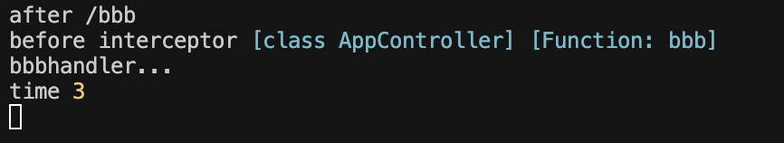

# 面向切面编程(AOP)

后端框架基本都是 MVC 的架构。

MVC 是 Model View Controller 的简写。MVC 架构下，请求会先发送给 Controller，由它调度 Model 层的 Service 来完成业务逻辑，然后返回对应的 View。


在这个流程中，Nest 还提供了 AOP （Aspect Oriented Programming）的能力，也就是面向切面编程的能力。

AOP 是什么意思呢？什么是面向切面编程呢？

一个请求过来，可能会经过 Controller（控制器）、Service（服务）、Repository（数据库访问） 的逻辑：


如果想在这个调用链路里加入一些通用逻辑该怎么加呢？比如日志记录、权限控制、异常处理等。

容易想到的是直接改造 Controller 层代码，加入这段逻辑。

这样可以，但是不优雅，因为这些通用的逻辑侵入到了业务逻辑里面。能不能透明的给这些业务逻辑加上日志、权限等处理呢？

那是不是可以在调用 Controller 之前和之后加入一个执行通用逻辑的阶段呢？

比如这样：


是不是就和切了一刀一样？

这样的横向扩展点就叫做切面，这种透明的加入一些切面逻辑的编程方式就叫做 AOP （面向切面编程）。

**AOP 的好处是可以把一些通用逻辑分离到切面中，保持业务逻辑的纯粹性，这样切面逻辑可以复用，还可以动态的增删。**

其实 Express 的中间件的洋葱模型也是一种 AOP 的实现，因为你可以透明的在外面包一层，加入一些逻辑，内层感知不到。

而 Nest 实现 AOP 的方式更多，一共有五种，包括 Middleware、Guard、Pipe、Interceptor、ExceptionFilter。


## 中间件Middleware

中间件是 Express 里的概念，Nest 的底层是 Express，所以自然也可以使用中间件，但是做了进一步的细分，分为了全局中间件和路由中间件。

全局中间件就是这样，在main.ts中写入:

```TS
import { NestFactory } from '@nestjs/core';
import { AppModule } from './app.module';
import { NextFunction, Request, Response } from 'express';
async function bootstrap() {
  const app = await NestFactory.create(AppModule);
  app.use(function (req: Request, res: Response, next: NextFunction) {
    console.log('before', req.url);

    next();
    console.log('after', req.url);
  });
  await app.listen(process.env.PORT ?? 3000);
}
bootstrap();

```

执行流程：

1. 当请求到达时，首先打印before和请求URL

1. 调用next()将控制权传递给下一个中间件

1. 下一个中间件完成处理并返回控制权

1. 然后打印after和请求URL

### 中间件执行顺序图示

```tcl
请求 → 中间件1开始 → next() → 中间件2开始 → next() → 路由处理函数 → 中间件2结束 → 中间件1结束 → 响应
```

### 重要特性

1. 洋葱模型：中间件执行类似洋葱层结构，请求先穿过所有中间件的"前半部分"(next()之前的代码)，再穿过"后半部分"(next()之后的代码)。
2. 流程控制：

- 不调用next()：请求处理在当前中间件终止

- 调用next()：继续执行下一个中间件

- 调用next(err)：跳过后续常规中间件，直接进入错误处理中间件

3. 终止请求：中间件可以通过res.send()、res.end()或res.json()等方法结束请求，不再执行后续中间件


### 后续实现

我们可以在具体的控制器的路由中添加打印:

```TS
import { Controller, Get } from '@nestjs/common';
import { AppService } from './app.service';

@Controller()
export class AppController {
  constructor(private readonly appService: AppService) {}

  @Get()
  getHello(): string {
    console.log('handler...');

    return this.appService.getHello();
  }
}

```


多添加几个路由:
```TS
import { Controller, Get } from '@nestjs/common';
import { AppService } from './app.service';

@Controller()
export class AppController {
  constructor(private readonly appService: AppService) {}


  @Get('aaa')
  aaa(): string {
    console.log('aaa handler...');

    return 'aaa';
  }

  @Get('bbb')
  bbb(): string {
    console.log('bbbhandler...');

    return 'bbb';
  }
}

```

浏览器一次访问这两个网址，可以看到中间件逻辑都执行了，且按照next()的前后顺序严格执行。


这种可以给在 handler 前后动态增加一些可复用的逻辑，就是 AOP 的切面编程的思想。

除了全局中间件，Nest 还支持路由中间件。

用 nest cli 创建一个路由中间件：

`nest g middleware log --no-spec --flat`

```javascript
import { Injectable, NestMiddleware } from '@nestjs/common';

@Injectable()
export class LogMiddleware implements NestMiddleware {
  use(req: Request, res: Response, next: () => void) {
    console.log('before2', req.url);
    next();
    console.log('after2', req.url);
  }
}

```


在app.module.ts中应用该logmiddleware:

```javascript
import { MiddlewareConsumer, Module, NestModule } from '@nestjs/common';
import { AppController } from './app.controller';
import { AppService } from './app.service';
import { LogMiddleware } from './log.middleware';

@Module({
  imports: [],
  controllers: [AppController],
  providers: [AppService],
})
export class AppModule implements NestModule{

  configure(consumer: MiddlewareConsumer) {
    consumer.apply(LogMiddleware).forRoutes('*');
  }

}


```

最后我们可以看到结果很类似于之前学习Koa的“洋葱模型”:


### 总结

1. 先从全局中间件过，即定义在main.ts启动器的app.use()内部的next()之前的方法穿梭一次。
2. 再从路由中间件过，即从log.middleware.ts中的use中的next()之前穿梭一次，切记需要在app.module.ts中继承和配置LogMiddleware。
3. 最后抵达app.controller.ts中对应路由的实现方法中。
4. 以此类推，执行next()后面的步骤，层层穿梭出来，和洋葱模型同理。


注意，这种方式大多数用于在抵达指定路由前进行数据处理或者通用配置，主要依赖于middleware建立的路由中间件，和express，koa的处理方式非常类似。


## Guard


Guard就是路由守卫，它的目的是为了在调用某个controller之前判定权限，通过返回boolean数据判定是否允许客户端请求放行:


先通过 `nest g guard login --no-spec --flat`生成login.guard.ts:

```javascript
import { CanActivate, ExecutionContext, Injectable } from '@nestjs/common';
import { Observable } from 'rxjs';

@Injectable()
export class LoginGuard implements CanActivate {
  canActivate(
    context: ExecutionContext,
  ): boolean | Promise<boolean> | Observable<boolean> {
    console.log('login check');

    return false;
  }
}

```

然后我们可以在controller里面随机抽取一个路由幸运儿来实现Guard路由守卫:

```TS
import { Controller, Get, UseGuards } from '@nestjs/common';
import { AppService } from './app.service';
import { LoginGuard } from './login.guard';

@Controller()
export class AppController {
  constructor(private readonly appService: AppService) {}

  @Get()
  getHello(): string {
    console.log('handler...');

    return this.appService.getHello();
  }

  @Get('aaa')
  @UseGuards(LoginGuard)
  aaa(): string {
    console.log('aaa handler...');

    return 'aaa';
  }

  @Get('bbb')
  bbb(): string {
    console.log('bbbhandler...');

    return 'bbb';
  }
}

```


这个时候/aaa对应的路由就不允许你随便访问了，因为我们已经在guard直接返回了false。

`@Guard`通过实现canactive方法来决定是否允许访问通过。

这意味着我们无需对controller进行前置处理，而是按照流程和规范对controller透明地进行了权限判断的前置约束，这是为什么需要AOP的原因。

同时Guard支持全局启用:


这会使得所有路由都必须应用这个Guard，当然你也可以选择在根应用的module里面来处理，这里就是AppModule:

```javascript
import { Module, NestModule, MiddlewareConsumer } from '@nestjs/common';
import { AppController } from './app.controller';
import { AppService } from './app.service';
import { LogMiddleware } from './log.middleware';
import { APP_GUARD } from '@nestjs/core';
import { LoginGuard } from './login.guard';
@Module({
  imports: [],
  controllers: [AppController],
  providers: [
    AppService,
    {
      provide: APP_GUARD,
      useClass: LoginGuard,
    },
  ],
})
export class AppModule implements NestModule {
  configure(consumer: MiddlewareConsumer) {
    consumer.apply(LogMiddleware).forRoutes('*');
  }
}

```

### 为什么全局Guard的provide是指定的APP_GUARD?

在NestJS中，使用APP_GUARD作为provide值有特殊意义。APP_GUARD是NestJS框架从@nestjs/core包中提供的一个特殊标记(token)，它告诉NestJS这个provider应该被注册为全局守卫(Guard)。

#### 原因解释

1. 依赖注入系统的标识：APP_GUARD是一个用于NestJS依赖注入系统的标识符，当框架启动时，它会寻找使用这个标识符注册的所有provider，并将它们注册为全局守卫。

1. 模块内注册全局守卫：使用APP_GUARD允许你在任何模块内注册全局守卫，而不必使用其他方法。这有助于保持代码的模块化和可维护性。

1. 解决循环依赖问题：当守卫需要注入来自同一模块的其他服务时，使用APP_GUARD可以避免潜在的循环依赖问题。

#### 与其他注册全局守卫方式的比较

除了使用APP_GUARD，你还可以通过以下方式注册全局守卫：

**这两种方式有什么区别？**

只要仔细观察就会发现,main.ts中的LoginGuard()是new出来的，这意味着其不受IOC容器的存储和控制。

但是用provide的形式声明的Guard则在IOC容器的里面，可以注入别的provider:


并且login.guard.ts中，我们可以直接在CanActive里面注入AppService,无需通过module形式，先在需要导出的service的module通过exports指定导出的service，然后再在对应的module导入指定的module来使用service:

```TS
import {
  CanActivate,
  ExecutionContext,
  Inject,
  Injectable,
} from '@nestjs/common';
import { Observable } from 'rxjs';
import { AppService } from './app.service';

@Injectable()
export class LoginGuard implements CanActivate {
  @Inject(AppService)
  private appService: AppService;
  canActivate(
    context: ExecutionContext,
  ): boolean | Promise<boolean> | Observable<boolean> {
    console.log('login check', this.appService.getHello());

    return false;
  }
}

```


所以如果需要注入别的provider的时候，需要使用第二种全局Guard的形式来实现IOC容器内部的service调用。

### NestJS中ExecutionContext（执行上下文）的作用

在您的LoginGuard中，context: ExecutionContext参数是守卫（Guard）实现canActivate方法所必需的，它提供了访问当前执行环境的能力。

ExecutionContext的主要作用包括：

1. 提供请求信息：让守卫可以访问当前HTTP请求的详细信息

1. 获取应用类型：区分是HTTP请求、WebSocket消息还是微服务请求

1. 访问处理程序：获取将要执行的控制器和处理方法信息

#### 实际用途

在您的守卫中，您可以使用ExecutionContext来检查用户是否已登录：

```javascript
// ... existing code ...
  canActivate(
    context: ExecutionContext,
  ): boolean | Promise<boolean> | Observable<boolean> {
    // 获取请求对象
    const request = context.switchToHttp().getRequest();
    
    // 检查用户是否已登录
    const isLoggedIn = request.session?.userId != null;
    
    // 根据登录状态返回true或false
    return isLoggedIn;
  }
// ... existing code ...
```

#### 常用方法

ExecutionContext提供了以下常用方法：

- switchToHttp(): 获取HTTP特定上下文，返回HttpArgumentsHost

- getClass(): 获取当前处理程序类

- getHandler(): 获取当前处理的方法引用

- getType(): 返回当前上下文类型（如'http'、'rpc'等）

在您目前的实现中，守卫始终返回false，这意味着所有请求都会被拒绝。通常，您需要基于请求中的信息（如认证令牌、会话等）做出判断。

## 路由守卫

### 全局路由守卫

```typescript
// main.ts 中注册
app.useGlobalGuards(new LoginGuard());

// 或者在 app.module.ts 中注册
{
  provide: APP_GUARD,
  useClass: LoginGuard,
}
```

**作用范围**：整个应用的**所有路由**都会被守卫保护

```typescript
// 所有这些路由都会经过 LoginGuard 检查
GET /          ← 会被守卫
GET /aaa       ← 会被守卫  
GET /bbb       ← 会被守卫
GET /ccc       ← 会被守卫
```

### **局部路由守卫**

```typescript
@Get('aaa')
@UseGuards(LoginGuard)  // 只保护这个路由
aaa(): string {
  return 'aaa';
}
```

**作用范围**：只保护**指定的路由**

```typescript
GET /          ← 不会被守卫
GET /aaa       ← 会被守卫（因为显式声明了）
GET /bbb       ← 不会被守卫  
GET /ccc       ← 不会被守卫
```

## 实际测试对比

### **开启全局守卫时**

```typescript
// 假设 LoginGuard 检查请求头中的 auth 字段
class LoginGuard {
  canActivate(context: ExecutionContext): boolean {
    const request = context.switchToHttp().getRequest();
    return request.headers.auth === 'valid';
  }
}
```

**访问结果**：

```bash
# 所有路由都需要认证
curl http://localhost:3000/          # 403 Forbidden
curl http://localhost:3000/aaa       # 403 Forbidden  
curl http://localhost:3000/bbb       # 403 Forbidden

# 带认证头才能访问
curl -H "auth: valid" http://localhost:3000/     # 200 OK
curl -H "auth: valid" http://localhost:3000/aaa  # 200 OK
```

### **关闭全局守卫，只用局部守卫时**

```typescript
// 当前你的配置：只有 /aaa 路由有 @UseGuards(LoginGuard)
```

**访问结果**：

```bash
# 大部分路由可以自由访问
curl http://localhost:3000/          # 200 OK (无需认证)
curl http://localhost:3000/bbb       # 200 OK (无需认证)
curl http://localhost:3000/ccc       # 200 OK (无需认证)

# 只有 /aaa 需要认证
curl http://localhost:3000/aaa       # 403 Forbidden
curl -H "auth: valid" http://localhost:3000/aaa  # 200 OK
```

## 使用场景对比

### **全局守卫适用场景**

```typescript
// 适合需要全局认证的应用
✅ 后台管理系统（所有页面都需要登录）
✅ API 系统（所有接口都需要 token）
✅ 企业内部系统

// 例外情况可以用装饰器跳过
@Get('public-info')
@Public()  // 跳过全局守卫
getPublicInfo() {
  return 'This is public';
}
```

### **局部守卫适用场景**

```typescript
// 适合有公开内容的应用
✅ 博客网站（部分内容需要登录）
✅ 电商网站（商品浏览公开，购买需登录）
✅ 社交媒体（部分功能需要认证）

@Get('posts')        // 公开访问
getPosts() { }

@Get('my-posts')     // 需要认证
@UseGuards(LoginGuard)
getMyPosts() { }
```

## 执行顺序和优先级

### **同时存在时的执行顺序**

```typescript
请求 → 全局守卫 → 控制器级守卫 → 方法级守卫 → 路由处理器
```

### **实际组合效果**

```typescript
// 如果同时开启全局和局部守卫
{
  provide: APP_GUARD,
  useClass: GlobalAuthGuard,  // 全局认证
}

@Get('admin')
@UseGuards(AdminGuard)  // 管理员权限检查
adminPanel() {
  return 'Admin only';
}

// 访问 /admin 需要：
// 1. 通过 GlobalAuthGuard（基础认证）
// 2. 通过 AdminGuard（管理员权限）
// 两个都通过才能访问
```

## 总结

**全局守卫**：

- 范围广，保护整个应用
- 适合需要统一认证的场景
- 配置一次，全局生效

**局部守卫**：

- 范围小，精确控制
- 适合细粒度权限控制
- 灵活性更高，按需配置

你当前的配置（关闭全局守卫）意味着只有 `/aaa` 路由受保护，其他路由都可以自由访问。这种配置适合对外开放的 API，只对特定敏感接口进行保护。

### 关键区别：依赖注入支持

#### **第一种方式（main.ts）- 不支持依赖注入**

```typescript
// main.ts
app.useGlobalGuards(new LoginGuard()); // ❌ 手动 new，无法注入依赖
```

**问题**：

- 手动 `new LoginGuard()` 创建实例
- **绕过了 NestJS 的 IoC 容器**
- 无法注入任何服务

```typescript
// login.guard.ts
@Injectable()
export class LoginGuard implements CanActivate {
  constructor(
    private appService: AppService,  // ❌ 这里会报错！无法注入
  ) {}
  
  canActivate(context: ExecutionContext): boolean {
    // this.appService 是 undefined
    return this.appService.validateUser(); // ❌ 运行时错误
  }
}
```

#### **第二种方式（app.module.ts）- 支持依赖注入**

```typescript
// app.module.ts
@Module({
  providers: [
    AppService,
    {
      provide: APP_GUARD,
      useClass: LoginGuard,  // ✅ 通过 IoC 容器创建，支持依赖注入
    },
  ],
})
export class AppModule {}
```

**优势**：

- 由 NestJS IoC 容器管理
- **自动解析和注入依赖**

```typescript
// login.guard.ts
@Injectable()
export class LoginGuard implements CanActivate {
  constructor(
    private appService: AppService,  // ✅ 可以正常注入
  ) {}
  
  canActivate(context: ExecutionContext): boolean {
    // this.appService 可以正常使用
    return this.appService.validateUser(); // ✅ 正常工作
  }
}
```

## Interceptor

这个也是一个拦截器，但是和Guard的区别在于，它既可以在Controller方法前面加入逻辑，也可以在Controller方法后面加入逻辑。


Controller 之前之后的处理逻辑可能是异步的。

Nest 里通过 rxjs 来组织它们，所以可以使用 rxjs 的各种 operator。

```javascript
import {
  CallHandler,
  ExecutionContext,
  Injectable,
  NestInterceptor,
} from '@nestjs/common';
import { Observable, tap } from 'rxjs';

@Injectable()
export class TimeInterceptor implements NestInterceptor {
  intercept(context: ExecutionContext, next: CallHandler): Observable<any> {
    const startTime = Date.now();

    return next.handle().pipe(
      tap(() => {
        console.log('time', Date.now() - startTime);
      }),
    );
  }
}

```

Interceptor要实现NestInterceptor接口，实现intercept方法，调用next.handle()就会调用目标Controller，可以在之前和之后添加一些处理逻辑。

Inerceptor的目标是controller，它可以通过context上下文来获取调用controller和它的handler:
```js
export class TimeInterceptor implements NestInterceptor {
  intercept(context: ExecutionContext, next: CallHandler): Observable<any> {
    const startTime = Date.now();
    console.log('before interceptor', context.getClass(), context.getHandler());

    return next.handle().pipe(
      tap(() => {
        console.log('time', Date.now() - startTime);
      }),
    );
  }
}
```




### next 对象

在 NestJS 拦截器中，next 是 CallHandler 类型的对象。它代表了请求处理管道中的下一个处理器，通常是：

1. 路由处理函数（即您在控制器中定义的方法，如 bbb()）

1. 或者管道中的下一个拦截器（如果有多个拦截器按顺序应用）

### handle() 方法

next.handle() 方法有以下作用：

1. 执行请求处理流程：它触发路由处理函数的执行

1. 返回 Observable：它返回一个 RxJS Observable，代表响应流

1. 允许操作响应：通过这个 Observable，您可以在响应返回给客户端前对其进行转换

### 代码工作流程

以您的时间拦截器为例，工作流程如下：

1. 拦截器被触发（当请求到达 /bbb 路由时）

1. 记录开始时间 startTime

1. 调用 next.handle() 执行路由处理函数（bbb()）

1. 使用 .pipe(tap()) 在响应流上添加一个副作用，计算并打印执行时间

1. 最后将响应返回给客户端


### 全局启用维度

它的全局启用有三个维度:
一个是controller层级的启用，使得下方所有的handler都会调用该拦截器:

```js
@Controller()
@UseInterceptors(TimeInterceptor)
export class AppController {
  constructor(private readonly appService: AppService) {}

```

一个是面向所有controller，和@Guard全局守卫同理，写在main.ts:

```javascript

async function bootstrap() {
  const app = await NestFactory.create(AppModule);
  app.useGlobalInterceptors(new TimeInterceptor());
  // app.useGlobalGuards(new LoginGuard());
  await app.listen(process.env.PORT ?? 3000);
}
bootstrap();

```

最后同理还有在app.module.ts进行配置的模块层面的全局启用:

```javascript
@Module({
  imports: [],
  controllers: [AppController],
  providers: [
    AppService,
    // {
    //   provide: APP_GUARD,
    //   useClass: LoginGuard,
    // },
    {
      provide: APP_INTERCEPTOR,
      useClass: TimeInterceptor,
    },
  ],
})
```


## Pipe

pipe主要是对参数进行校验和转化的:


```javascript
import { ArgumentMetadata, BadRequestException, Injectable, PipeTransform } from '@nestjs/common';

@Injectable()
export class ValidatePipe implements PipeTransform {
  transform(value: any, metadata: ArgumentMetadata) {
    if (Number.isNaN(parseInt(value))) {
      throw new BadRequestException('Validation failed');
    }

    return typeof value === 'number' ? value * 10 : parseInt(value) * 10;
  }
}

```

我们这里如果想实现PipeTransform接口，进一步实现transform方法，验证传入的value的参数，比如格式和类型是否正确。

一但不正确立刻丢出异常，当然这里也可以转化value返回转化后的值。


接下来在ccc进行验证:
```js
  @Get('ccc')
  ccc(@Query('num', ValidatePipe) num: number) {
    console.log('ccc handler...');

    return num + 1;
  }
```

需要注意，ValidatePipe这个pipe会写在Query(属性，pipe)的pipe占位符的位置。表示验证当前handler的传参。

这里会先验证num，如果num符合要求，那么就对它进行转化和返回，最后在handler里面执行返回和计算操作。

如果非num会返回400错误：


pipe的核心就是对参数进行校验，当然pipe可以只对某个参数有效，也可以对整个Controller全部生效:
```js
@Controller()
// @UseInterceptors(TimeInterceptor)
@UsePipes(ValidatePipe)
export class AppController {
  constructor(private readonly appService: AppService) {}

```

亦或者对全局和app.module.ts生效，这里就不再赘述了:


## ExceptionFilter

前面介绍的各个AOP都可以抛出异常，但是如果想真正对异常作相应，还是需要用ExceptionFilter:

ExceptionFilter 可以对抛出的异常做处理，返回对应的响应：


比如前面pipe抛出的new BadRequestException异常，能够自动处理为400报错响应，内部就是ExceptionFilter完成的:


实现一下ExceptionFilter:
```JS
import {
  ArgumentsHost,
  BadRequestException,
  Catch,
  ExceptionFilter,
} from '@nestjs/common';
import { Response } from 'express';
@Catch(BadRequestException)
export class TestFilter implements ExceptionFilter {
  catch(exception: BadRequestException, host: ArgumentsHost) {
    const response: Response = host.switchToHttp().getResponse();
    response.status(400).json({
      statusCode: 400,
      message: 'Bad Request' + exception.message,
    });
  }
}

```

这里很独特的就是使用@Catch()装饰符，并且内部写入了BadRequestException来作为传参，使得具体的catch实现里面能够定义exception实例。

在NestJS框架中，@Catch()装饰器用于指定异常过滤器要捕获的异常类型。在您的代码中，传递BadRequestException给@Catch装饰器表示：

这个过滤器只处理BadRequestException类型的异常。

1. @Catch(BadRequestException)告诉NestJS只有当抛出BadRequestException类型的异常时，才会调用这个过滤器

1. 如果应用中抛出了其他类型的异常（如UnauthorizedException或NotFoundException），这个过滤器不会被触发

1. 这种方式允许您为不同类型的异常创建特定的处理逻辑

如果您想让过滤器处理多种类型的异常，可以传递多个参数：

```javascript
@Catch(BadRequestException, UnauthorizedException)
```

或者如果您想捕获所有异常，可以不传参数：

```javascript
@Catch()
```

在您的实现中，过滤器捕获BadRequestException后，会返回一个状态码为400的JSON响应，并在消息中添加异常信息。

立刻调用@UseFilters装饰器在controller中的handler用起来:

```JS
  @Get('ccc')
  @UseFilters(TestFilter)
  ccc(@Query('num', ValidatePipe) num: number) {
    console.log('ccc handler...');

    return num + 1;
  }
```


### 几种 AOP 机制的顺序

优先调用Guard，主要用于判定是否有权限，无权限采用ExceptionFilter来抛出异常。

权限验证通关，就会开始应用拦截器，拦截器组织了一个链条，逐个向内调用直到执行controller具体的handler:


调用controller之前会对pipe进行处理，转化每个参数。

ExceptionFilter的调用时机很简单，在响应之前对异常进行处理。

而 Middleware 是 express 中的概念，Nest 只是继承了下，那个是在最外层被调用。


# 总结(面试高频)

Nest 基于 express 这种 http 平台做了一层封装，应用了 MVC、IOC、AOP 等架构思想。

MVC 就是 Model、View Controller 的划分，请求先经过 Controller，然后调用 Model 层的 Service、Repository 完成业务逻辑，最后返回对应的 View。

IOC 是指 Nest 会自动扫描带有 @Controller、@Injectable 装饰器的类，创建它们的对象，并根据依赖关系自动注入它依赖的对象，免去了手动创建和组装对象的麻烦。

AOP 则是把通用逻辑抽离出来，通过切面的方式添加到某个地方，可以复用和动态增删切面逻辑。

Nest 的 Middleware、Guard、Interceptor、Pipe、ExceptionFilter 都是 AOP 思想的实现，只不过是不同位置的切面，它们都可以灵活的作用在某个路由或者全部路由，这就是 AOP 的优势。

我们通过源码来看了它们的调用顺序，Middleware 是 Express 的概念，在最外层，到了某个路由之后，会先调用 Guard，Guard 用于判断路由有没有权限访问，然后会调用 Interceptor，对 Contoller 前后扩展一些逻辑，在到达目标 Controller 之前，还会调用 Pipe 来对参数做检验和转换。所有的 HttpException 的异常都会被 ExceptionFilter 处理，返回不同的响应。

Nest 就是通过这种 AOP 的架构方式，实现了松耦合、易于维护和扩展的架构。
