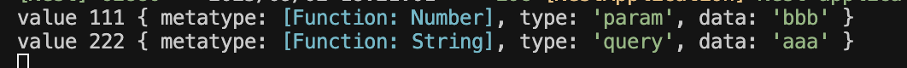

## Pipe 的执行时机和优先级

### 参数处理流程

typescript

```typescript
@Get('nnn/:bbb')
nnn(@Query('aaa', AaaPipe) aaa: string, @Param('bbb', AaaPipe) bbb: number) {
  return aaa + bbb;
}
```

**执行顺序**：

1. 请求到达：`http://localhost:3000/nnn/111?aaa=222`
2. NestJS 提取原始参数：
   - `@Query('aaa')` 提取到 `"222"`
   - `@Param('bbb')` 提取到 `"111"`
3. Pipe 转换阶段
   - `AaaPipe` 处理 `@Query('aaa')`: `"222"` → `"aaa"`
   - `AaaPipe` 处理 `@Param('bbb')`: `"111"` → `"aaa"`
4. Controller 方法执行
   - `aaa` 参数 = `"aaa"` (不是原始的 `"222"`)
   - `bbb` 参数 = `"aaa"` (不是原始的 `"111"`)
   - 返回：`"aaa" + "aaa"` = `"aaaaaa"`

## AaaPipe 的工作机制

```typescript
export class AaaPipe implements PipeTransform {
  transform(value: any, metadata: ArgumentMetadata) {
    console.log('value', value, metadata);
    return 'aaa';  // 无论输入什么，都返回 'aaa'
  }
}
```

**关键点**：

- `value`: 原始参数值 (`"222"` 或 `"111"`)
- `return 'aaa'`: **覆盖**原始值，强制返回 `'aaa'`



## 验证这个流程

### 控制台输出会是：

```
value 222 { type: 'query', metatype: [Function: String], data: 'aaa' }
value 111 { type: 'param', metatype: [Function: Number], data: 'bbb' }
```

### 最终响应：

```
aaaaaa
```

## Pipe 的优先级确实很高

### 参数处理的完整链路

```
原始请求参数 → Pipe 转换 → Controller 方法参数 → 方法执行 → 响应
     ↓              ↓              ↓             ↓         ↓
   "222"         "aaa"          aaa='aaa'    aaa+bbb    "aaaaaa"
   "111"         "aaa"          bbb='aaa'
```

## 更直观的对比例子

### 不使用 Pipe

```typescript
@Get('test/:id')
test(@Query('name') name: string, @Param('id') id: string) {
  return `name: ${name}, id: ${id}`;
}
// 访问 /test/123?name=john
// 输出: "name: john, id: 123"
```

### 使用 Pipe

```typescript
@Get('test/:id') 
test(@Query('name', AaaPipe) name: string, @Param('id', AaaPipe) id: string) {
  return `name: ${name}, id: ${id}`;
}
// 访问 /test/123?name=john  
// 输出: "name: aaa, id: aaa"  ← Pipe 完全覆盖了原始值
```

## 实际应用场景

### 正常的 Pipe 使用

```typescript
// 类型转换 Pipe
@Get('user/:id')
getUser(@Param('id', ParseIntPipe) id: number) {
  // 原始 "123" → 转换为数字 123
  return `User ID: ${id}`;  // id 是 number 类型
}

// 验证和转换 Pipe
export class ValidateAndTransformPipe implements PipeTransform {
  transform(value: string) {
    if (!value || value.length < 3) {
      throw new BadRequestException('Name too short');
    }
    return value.toUpperCase(); // 转换为大写
  }
}

@Get('hello/:name')
hello(@Param('name', ValidateAndTransformPipe) name: string) {
  return `Hello ${name}!`;
  // 访问 /hello/john → "Hello JOHN!"
}
```

## 总结

你的观察是正确的：

1. **Pipe 优先级确实很高** - 它在 Controller 方法执行前就完成了参数转换
2. **Pipe 可以完全改变参数值** - 不管原始输入是什么，都以 Pipe 的返回值为准
3. **Controller 方法接收的是转换后的值** - 不是原始的 URL 参数值
4. **这是设计如此** - Pipe 的目的就是在数据进入业务逻辑前进行验证、转换、清洗

所以你的 `aaa + bbb` 返回 `"aaaaaa"` 是完全符合预期的，因为两个参数都被 `AaaPipe` 转换成了 `"aaa"`。


# class-validator 工作原理

**装饰器 + 反射机制：**

1. `@IsInt()` 装饰器会在类上存储元数据（metadata）
2. ValidationPipe 通过反射读取这些元数据
3. 根据元数据规则对传入数据进行验证

**具体流程：**

```typescript
// 1. 装饰器存储验证规则到元数据
@IsInt() // 相当于告诉系统："这个字段必须是整数"
age: number;

// 2. ValidationPipe 内部大概这样工作：
// - 读取 Ooodto 类的元数据
// - 发现 age 字段有 @IsInt() 规则  
// - 检查传入的 obj.age 是否为整数
// - 不符合则抛出验证错误
```

## 你代码的问题和改进

**当前代码的问题：**

```typescript
export class Ooodto {
  name: string;        // 没有验证规则
  @IsInt()
  age: number;         // 只验证了age
  sex: boolean;        // 没有验证规则  
  hobbies: Array<string>; // 没有验证规则
}
```

**改进后的完整验证：**

```typescript
import { IsString, IsInt, IsBoolean, IsArray, IsNotEmpty } from 'class-validator';

export class Ooodto {
  @IsString()
  @IsNotEmpty()
  name: string;

  @IsInt()
  age: number;

  @IsBoolean() 
  sex: boolean;

  @IsArray()
  @IsString({ each: true }) // 验证数组中每个元素都是字符串
  hobbies: Array<string>;
}
```

## 实际业务应用场景

**用户注册验证：**

```typescript
import { IsEmail, MinLength, IsOptional } from 'class-validator';

export class RegisterDto {
  @IsEmail()
  email: string;

  @MinLength(6)
  password: string;

  @IsOptional()
  @IsString()
  nickname?: string;
}
```

**商品创建验证：**

```typescript
import { IsPositive, IsUrl, Min, Max } from 'class-validator';

export class CreateProductDto {
  @IsString()
  @IsNotEmpty()
  name: string;

  @IsPositive() // 必须是正数
  price: number;

  @IsUrl()
  @IsOptional()
  imageUrl?: string;

  @Min(0)
  @Max(999)
  stock: number;
}
```

## 业务价值

1. **统一验证逻辑** - 避免在每个接口里写重复的 if/else 验证
2. **声明式编程** - 验证规则清晰可读
3. **自动错误处理** - ValidationPipe 会自动返回格式化的错误信息
4. **类型安全** - 结合 TypeScript 提供编译时检查

**传统方式 vs 装饰器方式：**

```typescript
// 传统方式（繁琐）
if (!obj.name || typeof obj.name !== 'string') {
  throw new Error('name must be string');
}
if (!Number.isInteger(obj.age)) {
  throw new Error('age must be integer');
}

// 装饰器方式（简洁）
@IsString() name: string;
@IsInt() age: number;
```

这种模式让数据验证变得非常优雅和可维护，是现代 Web 开发的标准做法。


# ValidationPipe 核心逻辑

```typescript
import { PipeTransform, Injectable, ArgumentMetadata, BadRequestException } from '@nestjs/common';
import { validate } from 'class-validator';
import { plainToInstance } from 'class-transformer';
@Injectable()
export class MyValidationPipe implements PipeTransform<any> {
  async transform(value: any, { metatype }: ArgumentMetadata) {
    if (!metatype) {
      return value;
    }
    const object = plainToInstance(metatype, value);
    const errors = await validate(object);
    if (errors.length > 0) {
      throw new BadRequestException('参数验证失败');
    }
    return value;
  }
}
```


## 核心概念解析

### 问题背景

```typescript
// 当你这样写时：
@Post()
create(@Body() createUserDto: CreateUserDto) {
  // createUserDto 应该是什么？
}
```

从前端传来的 JSON 数据是**普通对象**，不是 CreateUserDto 类的实例，也没有经过验证。

### 转换和验证的必要性

#### 前端发送的数据

```json
{
  "email": "test@example.com",
  "username": "john",
  "age": "25"
}
```

#### 实际接收到的是

```typescript
// 普通 JavaScript 对象
const value = {
  email: "test@example.com", 
  username: "john",
  age: "25"  // 注意：这是字符串，不是数字
};

// 这个对象：
// 1. 不是 CreateUserDto 类的实例
// 2. 没有经过 class-validator 验证
// 3. 类型可能不正确（age 是字符串）
```

## 代码逐行解析

### 1. 获取目标类型

```typescript
async transform(value: any, { metatype }: ArgumentMetadata) {
  if (!metatype) {
    return value;  // 如果没有指定类型，直接返回
  }
  // metatype 就是 CreateUserDto 类
}
```

### 2. 类型转换

```typescript
import { PipeTransform, Injectable, ArgumentMetadata, BadRequestException } from '@nestjs/common';
import { validate } from 'class-validator';
import { plainToInstance } from 'class-transformer';
@Injectable()
export class MyValidationPipe implements PipeTransform<any> {
  async transform(value: any, { metatype }: ArgumentMetadata) {
    if (!metatype) {
      return value;
    }
    const object = plainToInstance(metatype, value);
    const errors = await validate(object);
    if (errors.length > 0) {
      throw new BadRequestException('参数验证失败');
    }
    return value;
  }
}
```

```typescript
const object = plainToInstance(metatype, value);
```

**这一步做了什么**：

```typescript
// 转换前：普通对象
const value = {
  email: "test@example.com",
  username: "john", 
  age: "25"  // 字符串
};

// 转换后：CreateUserDto 实例
const object = new CreateUserDto();
object.email = "test@example.com";
object.username = "john";
object.age = 25;  // 根据 DTO 定义自动转换为数字

// 现在 object 是真正的 CreateUserDto 实例
console.log(object instanceof CreateUserDto); // true
```

### 3. 验证

```typescript
const errors = await validate(object);
if (errors.length > 0) {
  throw new BadRequestException('参数验证失败');
}
```

**验证过程**：

```typescript
// CreateUserDto 中的验证装饰器开始工作
class CreateUserDto {
  @IsEmail()              // 检查 email 格式
  email: string;
  
  @MinLength(2)           // 检查 username 长度
  username: string;
  
  @IsInt()                // 检查 age 是否为整数
  @Min(0)                 // 检查 age 是否大于等于 0
  age: number;
}
```

## 完整的数据流

### 输入数据

```json
{
  "email": "invalid-email",
  "username": "a",
  "age": "25"
}
```

### 处理步骤

```typescript
// Step 1: 接收普通对象
const value = { email: "invalid-email", username: "a", age: "25" };

// Step 2: 转换为 DTO 实例
const object = plainToInstance(CreateUserDto, value);
// object 现在是 CreateUserDto 实例，age 被转换为数字 25

// Step 3: 验证
const errors = await validate(object);
// 发现错误：
// - email 格式不正确
// - username 长度小于 2

// Step 4: 抛出异常（因为有验证错误）
throw new BadRequestException('参数验证失败');
```

## 与内置 ValidationPipe 的对比

### 你写的简化版

```typescript
export class MyValidationPipe implements PipeTransform<any> {
  async transform(value: any, { metatype }: ArgumentMetadata) {
    const object = plainToInstance(metatype, value);  // 转换
    const errors = await validate(object);             // 验证
    if (errors.length > 0) {
      throw new BadRequestException('参数验证失败');   // 错误处理
    }
    return value;  // 返回原始值（这里有个小问题）
  }
}
```

### NestJS 内置的更完整

```typescript
// 内置的 ValidationPipe 还会：
// 1. 返回转换后的对象（而不是原始 value）
// 2. 提供详细的错误信息
// 3. 支持更多配置选项
// 4. 处理嵌套对象验证
// 5. 支持类型转换选项
```

## 实际使用效果

```typescript
@Post()
create(@Body(MyValidationPipe) createUserDto: CreateUserDto) {
  // 如果数据验证通过，createUserDto 就是转换和验证后的数据
  console.log(typeof createUserDto.age); // "number"（已转换）
  return this.usersService.create(createUserDto);
}
```

## 总结

作者想表达的是这个 Pipe 的**三个核心步骤**：

1. **接收**：获取前端传来的普通 JSON 对象
2. **转换**：用 `plainToInstance` 将普通对象转换为 DTO 类实例
3. **验证**：用 `validate` 对 DTO 实例执行 class-validator 验证

这就是 NestJS 验证机制的底层原理：**普通对象 → DTO 实例 → 验证 → 传递给 Controller**

不过你的代码有个小 bug：最后应该 `return object` 而不是 `return value`，因为转换后的对象才是正确的类型。
